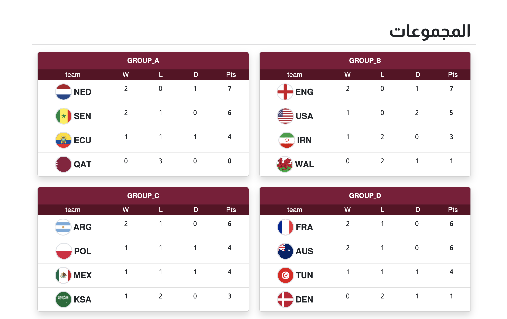
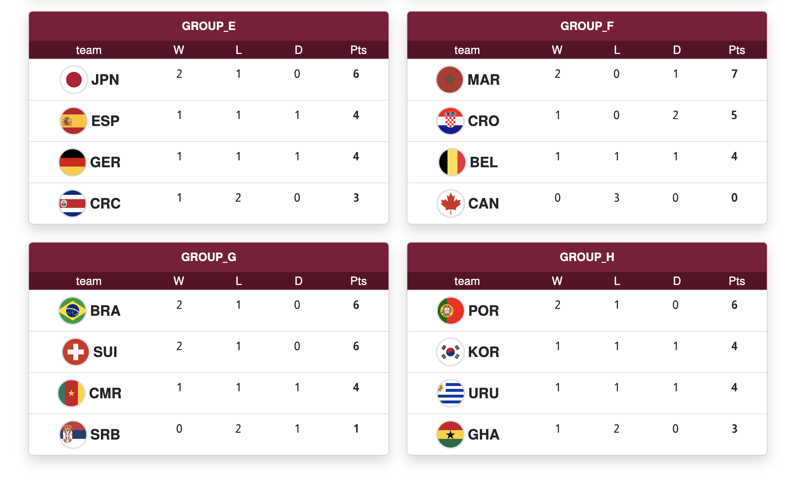
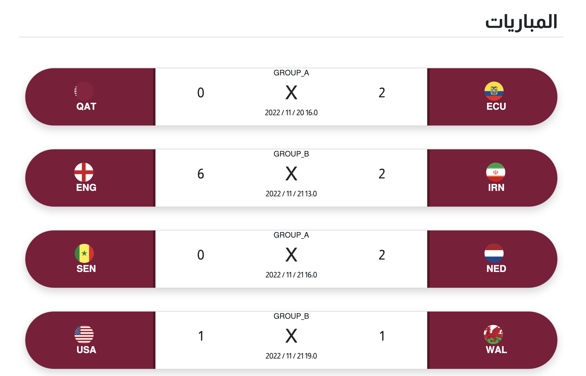
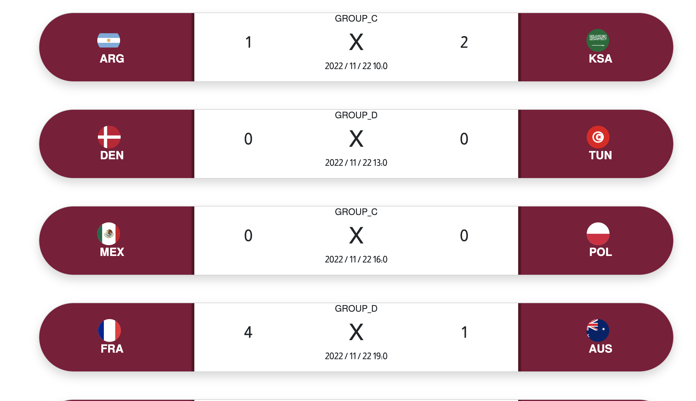
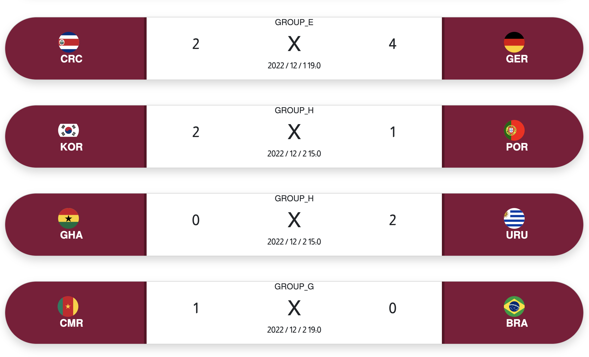

# موقع كأس العالم 2022

هذا المشروع يحتوي على الأكواد الكاملة لبناء موقع كأس العالم من خلال استخدام:
html - css - javascript - bootstrap
و الهدف منه تعليمي حيث أنه تابع لدرس:

[(إنشاء موقع كأس العالم)](https://www.youtube.com/watch?v=i190vlA7gE0&t=6067s&ab_channel=%D8%A3%D9%83%D8%A7%D8%AF%D9%8A%D9%85%D9%8A%D8%A9%D8%AA%D8%B1%D9%85%D9%8A%D8%B2) 

في قناة 

[(أكاديمية ترميز على اليوتيوب)](https://www.youtube.com/@user-py5qp1ez4y) 

## محتويات الموقع

### المجموعات

### المباريات

